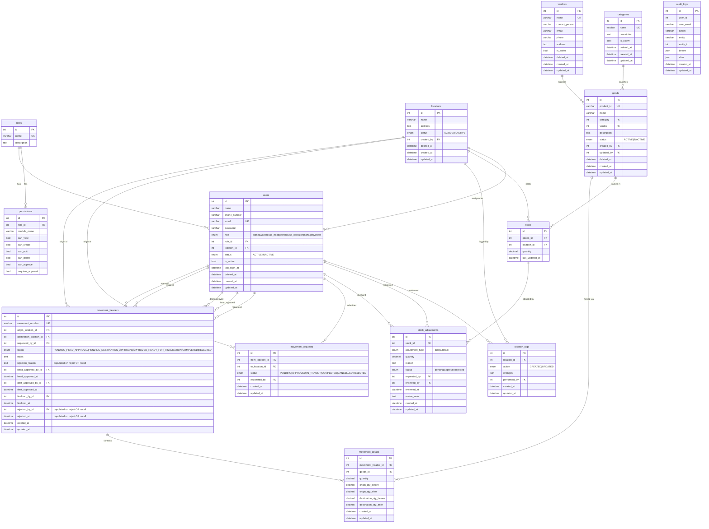

# Asset Management System
AI System Architecture Context

This file contains the canonical architecture and business rules
for the Asset Management System project.

All code generation must follow this specification.
If new features are introduced, this file must be updated.

---

## SYSTEM PURPOSE

The system manages warehouse assets including:

- goods
- stock across multiple locations
- movement of goods between locations
- users and roles
- approval workflow
- audit logging
- reporting dashboard

---

## CORE MODULES

1. Goods
2. Locations
3. Users
4. Roles & Permissions
5. Stock
6. Stock Adjustments
7. Movement Requests
8. Movements (Header + Detail)
9. Approval System
10. Audit Log
11. Dashboard
12. Admin Panel (Users, Locations, Categories, Vendors)
13. Categories
14. Vendors

---

## DATABASE ENTITIES

Active Sequelize models registered in `models/index.js`:

- **Role** – table `roles`
- **Permission** – table `permissions`
- **Category** – table `categories` (paranoid, soft-delete)
- **Vendor** – table `vendors` (paranoid, soft-delete)
- **Location** – table `locations` (paranoid, soft-delete)
- **LocationLog** – table `location_logs`
- **User** – table `users` (paranoid, soft-delete)
- **Goods** – table `goods` (paranoid, soft-delete; defaultScope filters INACTIVE)
- **Stock** – table `stock`
- **StockAdjustment** – table `stock_adjustments`
- **MovementRequest** – table `movement_requests` (simple operator request)
- **MovementHeader** – table `movement_headers` (full multi-step workflow header)
- **MovementDetail** – table `movement_details` (line items for a MovementHeader)
- **AuditLog** – table `audit_logs`

Legacy / dormant models still present in `models/`:

- `Good.js` — **not registered** in `models/index.js`; superseded by `Goods.js`.
- `Item.js` — registered as `db.Item` but has no associations and is not referenced by any current service. The `items` table is a legacy artifact; `Goods` is the single source of truth for products.
- `Movement.js` — registered as `db.Movement` but superseded by the `MovementHeader` + `MovementDetail` workflow. No current service uses it.

---

## BUSINESS RULES

### Goods and Location Status

If `status = INACTIVE`, the good or location cannot be selected in movement
requests or movements. The `Goods` model enforces this through a Sequelize
`defaultScope` that filters out inactive records automatically. Use
`Goods.unscoped()` or `Goods.scope('withInactive')` only when admin access
to all goods is explicitly required.

A location with `status = INACTIVE` also cannot be the target of a stock
adjustment. `stockAdjustmentService.requestAdjustment` fetches the `Location`
by `location_id` and throws HTTP 422 if `location.status !== 'ACTIVE'` before
any stock record is created or modified. This check mirrors the equivalent
goods ACTIVE check in the same function.

### Users

If `user.status = INACTIVE` or `user.isActive = false`, login must be
rejected and the user must not appear in active-user dropdowns.

A user cannot be deleted if they are the **last active admin** account.
Attempting to do so returns HTTP 409.

A user cannot be deleted while they have non-finalized movements where they
appear as requester or approver.

A user cannot delete their own account.

### Stock

Stock `quantity` is stored as `DECIMAL(15,4)` — fractional quantities are
supported.

Stock quantity cannot go below zero.

### Stock Adjustments

Manual stock adjustments support only `add` and `subtract` types. The `set`
type has been removed because it has no computable signed delta (the pre-set
quantity is not stored), making it incompatible with period summary reporting.
Adjustment `reviewed_at` is used as the effective date for period filtering.

**Active movement guard — location-scoped:** A stock adjustment request is
blocked (HTTP 409) when the target location is itself a participant in an
active `MovementHeader` (status ∈ `ACTIVE_MOVEMENT_STATUSES`) that contains
the requested goods. Crucially, the guard is **location-scoped**: an active
movement between Location A and Location B does not block Location C from
adjusting its own stock of the same goods, because Location C is not a
participant in that movement. The `MovementHeader` query filters by
`originLocationId` **or** `destinationLocationId` matching the adjustment's
`location_id` in addition to the goods match on `MovementDetail.goodsId`.

The validation order in `requestAdjustment` is:
1. Adjustment type (`add` / `subtract` only)
2. Goods exists and is `ACTIVE`
3. Location exists and is `ACTIVE`
4. Stock record found or created
5. Location is not a participant in an active movement containing these goods
6. Subtract pre-validation (quantity ≤ current stock)

### Movements

Movement cannot occur if origin stock is insufficient.

Destination location cannot equal origin location.

If destination stock record does not exist, the system must auto-create it.

### Soft Delete

The following entities support **paranoid (soft) delete** via Sequelize's
`paranoid: true` option, storing a `deleted_at` timestamp:

- `users`
- `goods`
- `locations`
- `categories`
- `vendors`

Soft-deleted records are excluded from all standard queries automatically.

### Location Deactivation and Deletion Guards

`locationService.update` and `locationService.remove` block deactivation or
soft-deletion of a location when any **active** `MovementHeader` references it
as origin or destination (status ∈ `ACTIVE_MOVEMENT_STATUSES` from
`utils/constants.js`). The same count is returned by `locationService.getImpact`
as `blockingMovements` for the impact-preview UI.

**Important:** All three guards query the `MovementHeader` model (columns
`originLocationId` / `destinationLocationId`) with `ACTIVE_MOVEMENT_STATUSES`.
The legacy `MovementRequest` model and its statuses `PENDING / APPROVED /
IN_TRANSIT` are **not used** for these checks. Any future code that adds
location-blocking logic must reference `MovementHeader`, not `MovementRequest`.

### Active Location Dropdown

Any dropdown that lists locations for assignment to users or for movement
selection must only include `status = ACTIVE` and non-deleted locations.

---

## MOVEMENT WORKFLOW

The system has two separate movement models:

### 1. Movement Requests (Simple)

Used by operators to submit transfer requests via `/api/movement-requests`.
Backed by `MovementRequest` model.

Status ENUM: `PENDING → APPROVED → IN_TRANSIT → COMPLETED | CANCELLED | REJECTED`

Approval roles:
- `warehouse_head` approves PENDING requests → IN_TRANSIT
- `warehouse_operator` whose `locationId` matches the request's `toLocationId` confirms IN_TRANSIT requests for their location → APPROVED

### 2. Movements (Full Workflow)

Used via `/api/movements`. Backed by `MovementHeader` + `MovementDetail` models.
Supports multiple goods per movement via line items.

```
1. warehouse_operator (origin) creates movement request
   MovementHeader.status = PENDING_HEAD_APPROVAL

2. warehouse_head (origin location) approves
   MovementHeader.status = PENDING_DESTINATION_APPROVAL

3. warehouse_operator (destination location) approves
   MovementHeader.status = APPROVED_READY_FOR_FINALIZATION

4. warehouse_operator or warehouse_head (destination location) finalizes
   — stock deducted from origin, added to destination
   MovementHeader.status = COMPLETED
```

**Rejection** (`POST /api/movements/:id/reject`): valid at `PENDING_HEAD_APPROVAL` or
`PENDING_DESTINATION_APPROVAL` only. Sets status to `REJECTED` and records `rejectedById`,
`rejectedAt`, and `rejectionReason`.

**Recall** (`POST /api/movements/:id/recall`): valid at `APPROVED_READY_FOR_FINALIZATION`
only. Used when a fully-approved movement must be halted before stock is touched.
Sets status to `REJECTED` with a mandatory reason. Accessible to origin `warehouse_head`,
destination `warehouse_head`, destination `warehouse_operator`, `admin`, and `manager`.

### Approval Ownership Rules

| Step | Role required | Location constraint |
|------|---------------|---------------------|
| Head approval | `warehouse_head` | Must belong to the **origin** location (`user.locationId === header.originLocationId`). `admin` and `manager` are exempt. |
| Destination approval | `warehouse_operator` | Must belong to the **destination** location (`user.locationId === header.destinationLocationId`). `admin` and `manager` are exempt. |
| Finalization | `warehouse_operator` or `warehouse_head` | Must belong to the **destination** location (`user.locationId === header.destinationLocationId`). `admin` and `manager` are exempt. |
| Recall (post-approval) | `warehouse_head` or `warehouse_operator` | Either the **origin** `warehouse_head` or any actor belonging to the **destination** location. `admin` and `manager` are exempt. |

> **Key design principle:** There is no separate `destination_operator` role. A `warehouse_operator`
> assigned to the destination warehouse fulfils the destination-side role automatically through
> location ownership checks (`user.locationId === header.destinationLocationId`).

---

## DUPLICATE MOVEMENT RULE

Three checks are applied inside the `createMovement` transaction:

1. **Route-scoped duplicate check** — if a non-finalized movement exists with
   the same origin, destination, and identical goods set, a new request is blocked.

2. **Goods-scoped in-flight lock** (`findActiveMovementForGoods`) — if any of the
   requested goods appear in **any** active `MovementHeader` (regardless of
   origin/destination), the new request is blocked. This prevents the same goods
   from being simultaneously committed to multiple movements.

3. **Pending stock adjustment lock** (`findPendingAdjustmentForGoods`) — if any of
   the requested goods have a `pending` `StockAdjustment` at either the origin **or**
   the destination location, the movement is blocked (HTTP 409). The operator must
   approve or reject that adjustment before a movement can be created.
   - **Why origin matters:** a pending adjustment may change the stock that the
     movement is about to deduct, causing an incorrect origin balance.
   - **Why destination matters:** a pending inbound adjustment at the destination
     may conflict with the incoming movement quantity once the movement is finalised.
   - The guard queries `StockAdjustment` where `status = 'pending'`, joining `Stock`
     filtered to `goodsId IN requestedGoodsIds` AND
     `locationId IN [originLocationId, destinationLocationId]`.

> **Note:** The equivalent guard in `stockAdjustmentService.requestAdjustment` is
> **location-scoped** against `MovementHeader` (not globally goods-scoped). It blocks
> only the locations that are direct participants (origin or destination) of an active
> movement, intentionally allowing uninvolved locations to adjust their own independent
> stock of the same goods. Movement creation uses the broader goods-only lock for
> `MovementHeader` because committing stock to two simultaneous movements from any
> pair of locations is always unsafe; a manual adjustment at an uninvolved location is
> safe because it does not affect in-transit quantities.

---

## ADMIN MODULE

Accessible only to users with `role = 'admin'` or `role = 'warehouse_head'`.

Frontend guard: `AdminRoute` component wraps all admin routes.

Admin module routes and their pages:

| Route          | Page             | Min Role        |
|----------------|------------------|-----------------|
| `/users`       | UsersPage        | admin           |
| `/locations`   | LocationsPage    | admin           |
| `/categories`  | CategoriesPage   | admin           |
| `/vendors`     | VendorsPage      | admin           |
| `/audit-log`   | AuditLogPage     | warehouse_head  |

---

## ROLE DEFINITIONS

| Role                 | Key Capabilities                                                                                                  |
|----------------------|-------------------------------------------------------------------------------------------------------------------|
| `admin`              | Full access; manage users, locations, categories, vendors                                                         |
| `manager`            | View and approve movements; no admin module access                                                                |
| `viewer`             | Read-only access to dashboard, assets, and movements                                                              |
| `warehouse_head`     | Head-approves and rejects/recalls movements at their origin location; manages master data and audit log           |
| `warehouse_operator` | Creates movement requests from their origin location; acts as destination approver and finalizer for movements arriving at their assigned location (`user.locationId === movement.destinationLocationId`) |

> **No `destination_operator` role exists.** The distinction between "origin operator" and
> "destination operator" is purely location-based: a `warehouse_operator` assigned to Warehouse A
> originates movements from A; a `warehouse_operator` assigned to Warehouse B approves and finalizes
> movements destined for B. The same role name covers both sides — the `locationId` field determines
> which side of a given movement the user acts on.

Permissions are also stored in the `permissions` table per role per module
with boolean flags: `can_view`, `can_create`, `can_edit`, `can_delete`,
`can_approve`, `requires_approval`.

---

## DASHBOARD FEATURES

- Stock overview per location (current quantities)
- **Stock period summary** — per `(goods, location)` aggregation for a chosen
  date range, showing `qty_before`, `inbound`, `outbound`, `adjustment_net`,
  `qty_after`, and `total_movement_requests`.
  Endpoint: `GET /api/dashboard/stock-period-summary?startDate=&endDate=&locationId=&goodId=`
- Quick-range date filter presets (1–3 weeks, 1–6 months) in `DashboardFilters.jsx`
- 365-day maximum date-range validation (client-side) on Dashboard and Stock pages
- Movement request status counts
- Recent movement activity
- Movement list filterable by status, origin and destination location
  (`GET /api/movements?status=&originLocationId=&destinationLocationId=`)
- Movement recall — `POST /api/movements/:id/recall` transitions
  `APPROVED_READY_FOR_FINALIZATION → REJECTED` without updating stock

### Stock Period Summary Algorithm

For each `(goods_id, location_id)` pair tracked in the `stock` table:

1. **inbound** — `SUM(detail.quantity)` for `COMPLETED` movements where
   `header.destination_location_id = location_id` and `header.finalized_at`
   falls inside the requested period.
2. **outbound** — `SUM(detail.quantity)` for `COMPLETED` movements where
   `header.origin_location_id = location_id` and `header.finalized_at`
   falls inside the requested period.
3. **adjustment_net** — net signed delta from `approved` stock adjustments
   (`add` − `subtract`) where `reviewed_at` falls inside the period.
   `set`-type adjustments are excluded (no computable delta without a before-snapshot).
4. **qty_after** — current `Stock.quantity` (live value from the `stock` table).
5. **qty_before** — `max(0, qty_after − inbound + outbound − adjustment_net)` —
   reverse-computed from the live stock, accounting for both movements and manual
   adjustments, so the figure always reconciles with current reality.
6. **total_movement_requests** — count of distinct `MovementHeader` IDs (any
   status) whose `createdAt` falls inside the period and that involve this
   location (as origin **or** destination) for this goods item.

Verification example (from the period summary column identity):
`qty_before + inbound − outbound + adjustment_net = qty_after`
e.g. `50 + 300 − 200 + (−50) = 100` ✓

---

## AUDIT LOG

All create, update, and delete operations must generate an audit log entry
via `auditLogService`.

AuditLog fields:

| Field       | Description                                      |
|-------------|--------------------------------------------------|
| `userId`    | ID of the user who performed the action          |
| `userEmail` | Snapshot of email at time of action              |
| `action`    | Verb: `CREATE`, `UPDATE`, `DELETE`, etc.         |
| `entity`    | Model name, e.g. `User`, `Goods`, `Location`     |
| `entityId`  | ID of the affected record                        |
| `before`    | JSON snapshot of the record before the change    |
| `after`     | JSON snapshot of the record after the change     |

AuditLog has no FK constraint on `userId` (soft reference only) so that log
entries survive user deletion.

---


## CANONICAL REFERENCE-DATA ENDPOINTS

Use these endpoints for dropdown/reference data in frontend workflows:

- `GET /api/reference-data/locations`
- `GET /api/reference-data/goods`
- `GET /api/reference-data/stocks?locationId=`

Legacy compatibility route `GET /api/reference-data/items` may exist as an alias,
but new code should use `/goods` and goods-based field names (`goodsId`,
`productId`) only.

---

## CANONICAL SEED DATA EXPECTATIONS

Backend seeders should maintain a deterministic baseline compatible with the
active model/schema contract:

- Roles use canonical enum names: `admin`, `manager`, `viewer`,
  `warehouse_head`, `warehouse_operator`.
- Categories and vendors use `name` (not legacy `category`/`vendor` columns).
- Goods use `product_id`, `status`, `created_by`, `updated_by`,
  `created_at`, `updated_at`.
- `seed-users` provides warehouse-head coverage for both seeded locations
  (Main Warehouse and Secondary Warehouse).
- `seed-stock` seeds stock in table `stock` (singular), and baseline quantities
  are consistent across seeded goods/location pairs.

These constraints prevent runtime drift between seeded data and service logic.

---

## ERD


