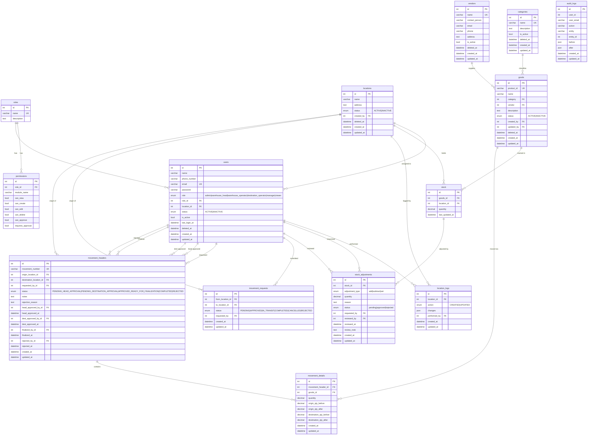

# Asset Management System
AI System Architecture Context

This file contains the canonical architecture and business rules
for the Asset Management System project.

All code generation must follow this specification.
If new features are introduced, this file must be updated.

---

## SYSTEM PURPOSE

The system manages warehouse assets including:

- goods
- stock across multiple locations
- movement of goods between locations
- users and roles
- approval workflow
- audit logging
- reporting dashboard

---

## CORE MODULES

1. Goods
2. Locations
3. Users
4. Roles & Permissions
5. Stock
6. Stock Adjustments
7. Movement Requests
8. Movements (Header + Detail)
9. Approval System
10. Audit Log
11. Dashboard
12. Admin Panel (Users, Locations, Categories, Vendors)
13. Categories
14. Vendors

---

## DATABASE ENTITIES

Active Sequelize models registered in `models/index.js`:

- **Role** – table `roles`
- **Permission** – table `permissions`
- **Category** – table `categories` (paranoid, soft-delete)
- **Vendor** – table `vendors` (paranoid, soft-delete)
- **Location** – table `locations` (paranoid, soft-delete)
- **LocationLog** – table `location_logs`
- **User** – table `users` (paranoid, soft-delete)
- **Goods** – table `goods` (paranoid, soft-delete; defaultScope filters INACTIVE)
- **Stock** – table `stock`
- **StockAdjustment** – table `stock_adjustments`
- **MovementRequest** – table `movement_requests` (simple operator request)
- **MovementHeader** – table `movement_headers` (full multi-step workflow header)
- **MovementDetail** – table `movement_details` (line items for a MovementHeader)
- **AuditLog** – table `audit_logs`

Legacy/unused models still present in `models/` but NOT in `models/index.js`:

- `Good.js` (superseded by `Goods.js`)
- `Goods.js` (the active one registered as `db.Goods`)
- `Item.js` (registered but not used in current services)
- `Movement.js` (simple movement model, superseded by MovementHeader workflow)

---

## BUSINESS RULES

### Goods and Location Status

If `status = INACTIVE`, the good or location cannot be selected in movement
requests or movements. The `Goods` model enforces this through a Sequelize
`defaultScope` that filters out inactive records automatically. Use
`Goods.unscoped()` or `Goods.scope('withInactive')` only when admin access
to all goods is explicitly required.

### Users

If `user.status = INACTIVE` or `user.isActive = false`, login must be
rejected and the user must not appear in active-user dropdowns.

A user cannot be deleted if they are the **last active admin** account.
Attempting to do so returns HTTP 409.

A user cannot be deleted while they have non-finalized movements where they
appear as requester or approver.

A user cannot delete their own account.

### Stock

Stock `quantity` is stored as `DECIMAL(15,4)` — fractional quantities are
supported.

Stock quantity cannot go below zero.

### Movements

Movement cannot occur if origin stock is insufficient.

Destination location cannot equal origin location.

If destination stock record does not exist, the system must auto-create it.

### Soft Delete

The following entities support **paranoid (soft) delete** via Sequelize's
`paranoid: true` option, storing a `deleted_at` timestamp:

- `users`
- `goods`
- `locations`
- `categories`
- `vendors`

Soft-deleted records are excluded from all standard queries automatically.

### Active Location Dropdown

Any dropdown that lists locations for assignment to users or for movement
selection must only include `status = ACTIVE` and non-deleted locations.

---

## MOVEMENT WORKFLOW

The system has two separate movement models:

### 1. Movement Requests (Simple)

Used by operators to submit transfer requests via `/api/movement-requests`.
Backed by `MovementRequest` model.

Status ENUM: `PENDING → APPROVED → IN_TRANSIT → COMPLETED | CANCELLED | REJECTED`

Approval roles:
- `warehouse_head` approves PENDING requests
- `destination_operator` confirms IN_TRANSIT requests for their location

### 2. Movements (Full Workflow)

Used via `/api/movements`. Backed by `MovementHeader` + `MovementDetail` models.
Supports multiple goods per movement via line items.

```
1. Operator creates movement
   MovementHeader.status = PENDING_HEAD_APPROVAL

2. Warehouse Head approves
   MovementHeader.status = PENDING_DESTINATION_APPROVAL

3. Destination Operator approves
   MovementHeader.status = APPROVED_READY_FOR_FINALIZATION

4. Finalization updates stock on both sides
   MovementHeader.status = COMPLETED
```

Rejection at any step sets status to `REJECTED` and records `rejectedById`,
`rejectedAt`, and `rejectionReason` on the header.

---

## DUPLICATE MOVEMENT RULE

If a movement request exists with:

- same origin
- same destination
- same items

and is not finalized

a new request cannot be created.

---

## ADMIN MODULE

Accessible only to users with `role = 'admin'` or `role = 'warehouse_head'`.

Frontend guard: `AdminRoute` component wraps all admin routes.

Admin module routes and their pages:

| Route          | Page             | Min Role        |
|----------------|------------------|-----------------|
| `/users`       | UsersPage        | admin           |
| `/locations`   | LocationsPage    | admin           |
| `/categories`  | CategoriesPage   | admin           |
| `/vendors`     | VendorsPage      | admin           |
| `/audit-log`   | AuditLogPage     | warehouse_head  |

---

## ROLE DEFINITIONS

| Role                  | Key Capabilities                                              |
|-----------------------|---------------------------------------------------------------|
| `admin`               | Full access; manage users, locations, categories, vendors     |
| `warehouse_head`      | Approve/reject movements, view audit log, manage master data  |
| `warehouse_operator`  | Submit movement requests, view own stock and movements        |
| `destination_operator`| Confirm inbound transfers targeting their location            |

Permissions are also stored in the `permissions` table per role per module
with boolean flags: `can_view`, `can_create`, `can_edit`, `can_delete`,
`can_approve`, `requires_approval`.

---

## DASHBOARD FEATURES

- Stock overview per location
- Movement request status counts
- Recent movement activity

---

## AUDIT LOG

All create, update, and delete operations must generate an audit log entry
via `auditLogService`.

AuditLog fields:

| Field       | Description                                      |
|-------------|--------------------------------------------------|
| `userId`    | ID of the user who performed the action          |
| `userEmail` | Snapshot of email at time of action              |
| `action`    | Verb: `CREATE`, `UPDATE`, `DELETE`, etc.         |
| `entity`    | Model name, e.g. `User`, `Goods`, `Location`     |
| `entityId`  | ID of the affected record                        |
| `before`    | JSON snapshot of the record before the change    |
| `after`     | JSON snapshot of the record after the change     |

AuditLog has no FK constraint on `userId` (soft reference only) so that log
entries survive user deletion.

---

## ERD


